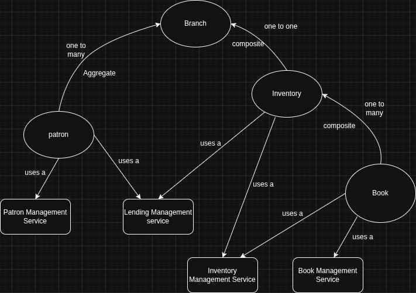

# Library Management System

A simple **in-memory Library Management System** written in Java. This project allows managing books, patrons, and lending operations such as checkout and return. It uses plain Java with a service-oriented architecture and demonstrates logging, collections, and object management.

---

## Features

- Add, update, and remove books in the library inventory.
- Add and update patrons.
- Search books by title or author.
- Checkout and return books for patrons.
- Track borrowed books and their history.
- View current inventory and library summary (total copies, total available books).
- Interactive CLI (command-line interface) for user-driven operations.

---

## Project Structure

```
src/main/java/org/example/
 ├── Main.java                  # Entry point with interactive CLI
 ├── constants/
 │    └── LendingEventType.java # Enum for lending events (CHECKED_OUT, RETURN)
 ├── models/
 │    ├── Book.java
 │    ├── Patron.java
 │    ├── BorrowedBookHistroy.java
 │    └── LendingEvent.java
 └── service/
      ├── BookManagementService.java
      ├── InventoryManagementService.java
      ├── LendingManagementService.java
      ├── PatronManagementService.java
      └── impl/
           ├── BookManagementServiceImpl.java
           ├── InventoryManagementServiceImpl.java
           ├── LendingManagementServiceImpl.java
           └── PatronMangementServiceImpl.java
```

---

## Prerequisites

- Java 17+
- Maven 3.8+ (for dependency management if needed)
- Optional: Lombok plugin in your IDE for `@Getter`, `@Setter`, `@ToString`, etc.

---

## How to Run

1. Clone the repository:
```bash
git clone <repository_url>
cd library-management-system
```

2. Build the project using Maven:
```bash
mvn clean compile
```

3. Run the interactive CLI:
```bash
mvn exec:java -Dexec.mainClass="org.example.Main"
```

---

## Usage

The application presents a **menu-driven interface**:

1. Add books with details such as title, author, genre, publication year, and number of copies.
2. Add patrons with a name and unique ID.
3. Search books by title or author.
4. Checkout and return books for patrons.
5. Remove books from inventory.
6. View inventory to see all books currently in the system.
7. View library summary, including total copies and total available books.

---

### Example Interaction

```
===== Library Management Menu =====
1. Add Book
2. Add Patron
3. Search Books
4. Checkout Book
5. Return Book
6. Remove Book
7. View Inventory
8. Library Summary
0. Exit

Enter your choice: 1
Enter book ID: 1
Enter title: Clean Code
Enter author: Robert C. Martin
Enter genre: Programming
Enter publication year: 2008
Enter number of copies: 5
Successfully added the books in the inventory
```

---

## Logging

- Uses **SLF4J + Lombok @Slf4j** for logging.
- Logs important operations such as adding books, checkout/return events, and errors when books or patrons are not found.

---

## Notes

- All data is **stored in-memory** using static maps and sets; no database is required.
- `InventoryManagementService` tracks books, availability, and borrowed books.
- `PatronMangementService` tracks patrons and their borrowed book history.
- `LendingManagementService` coordinates between patrons and inventory for lending events.

---

## Entity Relationship Diagram
#
